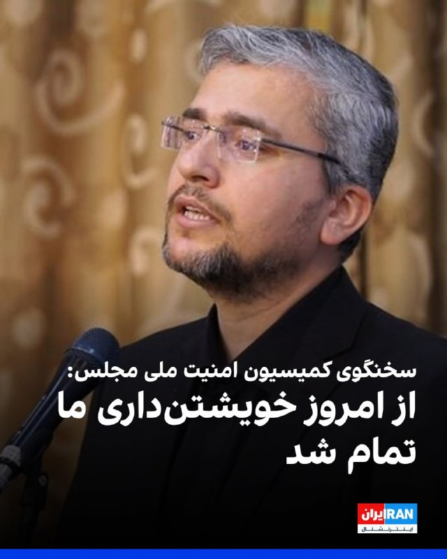
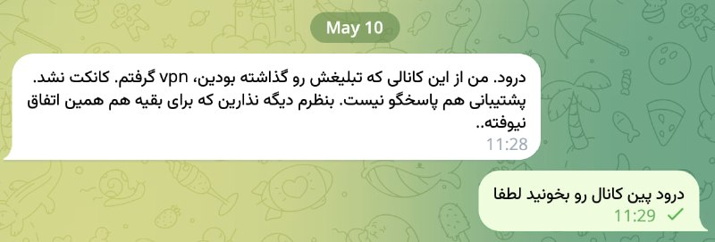
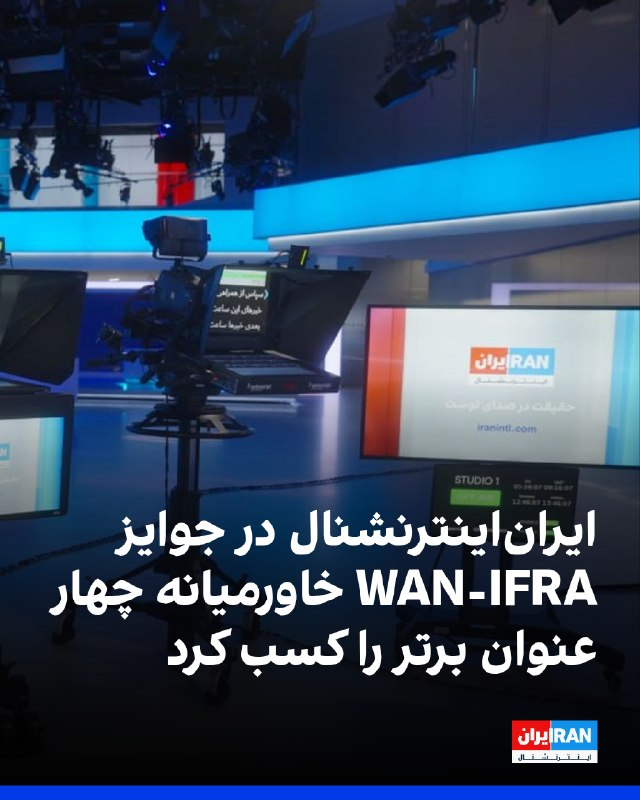
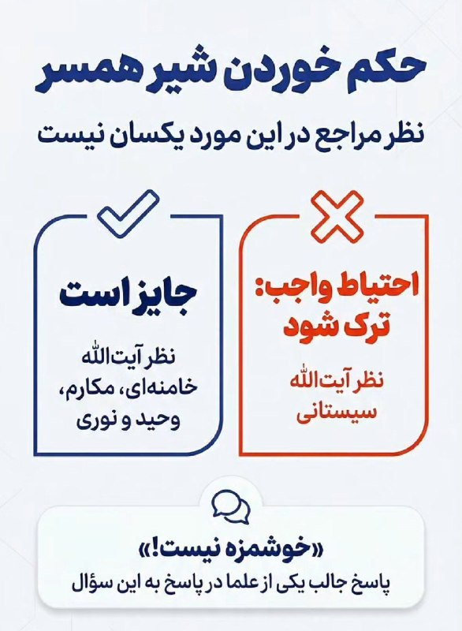
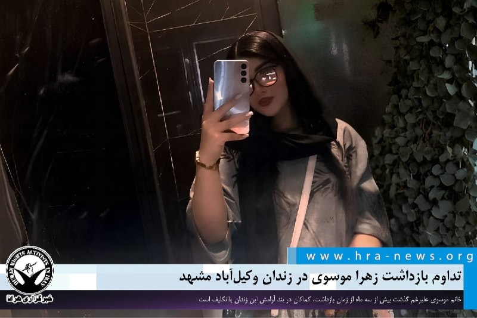

# خواننده تلگرام

<!-- TOP_NAV START -->

<a href="https://github.com/ProAlit/aio-downloader/blob/main/telegram/content/archive_1.md" style="display:inline-block; padding:6px 12px; margin:0 4px; background-color:#2ea44f; color:white; text-decoration:none; border-radius:4px; font-weight:bold;">صفحه بعد</a>

<!-- TOP_NAV END -->

<!-- MSG START -->

---
📅 بروزرسانی: 1405/02/20 14:53
---

## VahidOOnLine — post 239264

  

ابراهیم رضایی، سخنگوی کمیسیون امنیت ملی مجلس، در شبکه ایکس نوشت: «از امروز خویشتن‌داری ما تمام شد و هر تعرضی به شناورهای ما، با پاسخ سنگین و قاطع به شناورها و پایگاه‌های آمریکایی مواجه خواهد شد.»

او خطاب به آمریکایی‌ها نوشت: «بهترین راه، تسلیم‌شدن و دادن امتیاز است. باید به نظم منطقه‌ای جدید عادت کنید.»
iranintl
‌🏁 🇬🇧 IranintlTV

🤖 @VahidOOnLine

## VahidOOnLine — post 239263

  

ایران‌اینترنشنال موفق شد در چهار بخش جوایز رسانه‌های دیجیتال خاورمیانه انجمن جهانی ناشران اخبار (WAN-IFRA) را از آن خود کند. یکی از پروژه‌های این شبکه نیز به مرحله نهایی رقابت‌های جهانی راه یافت.

براساس اعلام WAN-IFRA در رقابت‌های رسانه‌های دیجیتال خاورمیانه ۲۰۲۶، پروژه‌های ایران‌اینترنشنال شامل «مدیا بات»، کمپین «زن، زندگی، آزادی» و «نقشه تعاملی اهداف اسرائیل در جنگ ۱۲ روزه» موفق به کسب عنوان برندگان منطقه‌ای در چند بخش شدند.
کمپین «زن، زندگی، آزادی» جایزه «بهترین کمپین بازاریابی برای یک برند خبری» را دریافت کرد. داوران این بخش از تاثیرگذاری، خلاقیت و گستره مخاطبان این پروژه تقدیر کردند.
پروژه «نقشه تعاملی اهداف اسرائیل در جنگ ۱۲ روزه» برنده بخش «بهترین مصورسازی داده» در منطقه خاورمیانه شد.

«مدیا بات»، ربات تلگرامی ایران‌اینترنشنال نیز در دو بخش «نوآورانه‌ترین محصول دیجیتال» و «بهترین تعامل با مخاطب» برنده شد. این محصول با هدف تسهیل دسترسی کاربران به اخبار و محتوای چندرسانه‌ای طراحی شده است. «مدیا بات» در ادامه رقابت، به مرحله جهانی جوایز WAN-IFRA نیز راه یافته است.
‌🏁 🇬🇧 IranintlTV

🤖 @VahidOOnLine

## VahidOOnLine — post 239262

  

♦️وزارت دفاع امارات متحده عربی روز یکشنبه ۲۰ اردیبهشت اعلام کرد که سامانه‌های پدافند هوایی این کشور با موفقیت دو پهپاد پرتاب شده از «ایران» را منهدم کردند.
این وزارتخانه تاکید کرده است که از زمان ««شروع حملات آشکار ایران، پدافند هوایی امارات متحده عربی در مجموع ۵۵۱ موشک بالستیک، ۲۹ موشک کروز و ۲۲۶۵ پهپاد را منهدم کرده است.»
وزارت دفاع امارات همچنین گزارش داده است که از زمان شروع حملات آشکار ایران، تعداد کل جانباختگان نظامی به ۳ نفر رسیده و تلفات غیرنظامی هم ۱۰ نفر از ملیت‌های پاکستانی، نپالی، بنگلادشی، فلسطینی، هندی و مصری است.
وزارت دفاع امارات متحده عربی همچنین بر آمادگی کامل این کشور برای مقابله با هرگونه تهدیدی تاکید کرده و اعلام کرده است که قاطعانه با هر چیزی که قصد تضعیف امنیت کشور را داشته باشد، مقابله خواهد کرد.

در روزهای گذشته مقام‌های جمهوری اسلامی بارها امارات متحده عربی را تهدید به «برخورد قاطع نظامی» کرده‌اند.
‌🇸🇦 Indypersian

🤖 @VahidOOnLine

## mamlekate — post 103492

  <a href="telegram/content/mamlekate_103492_1778412195.mp4" target="_blank">🎬 Download video</a>

در جریان سومین ماه قطعی اینترنت در داخل ایران، یک ایرانی در خارج، تست آزمایش سرعت اینترنت خود را منتشر کرد. گفته شده این ایرانی باید سریع‌ترین اینترنت خانگی دنیا رو داشته باشه.

@mamlekate

## mamlekate — post 103491

  

توضیحی تکراری: تبلیغاتی که توی تلگرام نمایش داده میشن، بصورت اتوماتیک توسط تلگرام نمایش داده میشن. ادمین کانال‌ها، نقشی توی نمایش تبلیغات تلگرام ندارند.

تماس با افرادی که نمی‌شناسین دو ریسک داره: یکی ریسک از دست دادن پولتون. دومین ریسک هم مربوط به اطلاعات شماست. مراقب افشای اطلاعات خودتون به این مافیاهای شیاد باشید.

مملکته هیچ ارتباطی با فروش وی‌پی‌ان، کانفیگ، استارلینک و اخیرا سیم‌کارت سفید یا هر تبلیغ عمومی یا مارکتینگ‌های دایرکتی دیگه نداشته، نداره و نخواهد داشت.

@mamlekate

## IranIntlTV — post 336447

  

ابراهیم رضایی، سخنگوی کمیسیون امنیت ملی مجلس، در شبکه ایکس نوشت: «از امروز خویشتن‌داری ما تمام شد و هر تعرضی به شناورهای ما، با پاسخ سنگین و قاطع به شناورها و پایگاه‌های آمریکایی مواجه خواهد شد.»

او خطاب به آمریکایی‌ها نوشت: «بهترین راه، تسلیم‌شدن و دادن امتیاز است. باید به نظم منطقه‌ای جدید عادت کنید.»
iranintl.com/202605106244

## IranIntlTV — post 336446

  

ایران‌اینترنشنال موفق شد در چهار بخش جوایز رسانه‌های دیجیتال خاورمیانه انجمن جهانی ناشران اخبار (WAN-IFRA) را از آن خود کند. یکی از پروژه‌های این شبکه نیز به مرحله نهایی رقابت‌های جهانی راه یافت.

براساس اعلام WAN-IFRA در رقابت‌های رسانه‌های دیجیتال خاورمیانه ۲۰۲۶، پروژه‌های ایران‌اینترنشنال شامل «مدیا بات»، کمپین «زن، زندگی، آزادی» و «نقشه تعاملی اهداف اسرائیل در جنگ ۱۲ روزه» موفق به کسب عنوان برندگان منطقه‌ای در چند بخش شدند.
کمپین «زن، زندگی، آزادی» جایزه «بهترین کمپین بازاریابی برای یک برند خبری» را دریافت کرد. داوران این بخش از تاثیرگذاری، خلاقیت و گستره مخاطبان این پروژه تقدیر کردند.
پروژه «نقشه تعاملی اهداف اسرائیل در جنگ ۱۲ روزه» برنده بخش «بهترین مصورسازی داده» در منطقه خاورمیانه شد.

«مدیا بات»، ربات تلگرامی ایران‌اینترنشنال نیز در دو بخش «نوآورانه‌ترین محصول دیجیتال» و «بهترین تعامل با مخاطب» برنده شد. این محصول با هدف تسهیل دسترسی کاربران به اخبار و محتوای چندرسانه‌ای طراحی شده است. «مدیا بات» در ادامه رقابت، به مرحله جهانی جوایز WAN-IFRA نیز راه یافته است.
https://iranintl.com/202605092229

## FarsiVOA — post 217334

  <a href="telegram/content/FarsiVOA_217334_1778412200.mp4" target="_blank">🎬 Download video</a>

ارتش اسرائیل اعلام کرد نیروهای تیپ کفیر، تحت فرماندهی لشکر غزه، در ادامه عملیات پاکسازی در محدوده اردوگاه‌های مرکزی نوار غزه، در شرق خط زرد، دو مسیر زیرزمینی را منهدم کردند.

بر اساس اعلام ارتش اسرائیل، این دو مسیر تونلی در مجموع حدود دو کیلومتر طول داشتند و در جریان عملیات، چند اتاق اقامت و مقادیر مختلفی سلاح در داخل آنها شناسایی شد.

ارتش اسرائیل همچنین اعلام کرد نیروهایش در جریان جست‌وجوهای میدانی در این منطقه، ده‌ها راکت و مواد انفجاری را نیز کشف کرده‌اند.

طبق بیانیه ارتش اسرائیل، نیروهای فرماندهی جنوب همچنان بر اساس چارچوب توافق آتش‌بس در منطقه مستقر هستند و به عملیات برای رفع هرگونه تهدید فوری ادامه خواهند داد.
@FarsiVOA

## BBCPersian — post 280647

  <a href="telegram/content/BBCPersian_280647_1778412204.mp4" target="_blank">🎬 Download video</a>

این صحنه‌ای است که بی‌بی‌سی به اشتباه به جای گای کوینی، روزنامه‌نگار حوزه فناوری، با گای گوما، که برای یک مصاحبه شغلی آمده بود، به صورت زنده مصاحبه کرد.

۲۰ سال پیش، در تاریخ ۸ مه ۲۰۰۶، گوما برای مصاحبه‌ای به بی‌بی‌سی دعوت شد. اما در پذیرش، او را با کوینی اشتباه گرفتند و از یک برنامه زنده از کانال خبری بی‌بی‌سی سردرآورد. گوما در این موقعیت عجیب جا نزد و با وجود اینکه از موضوع خبر نداشت، به سوالات مجری پاسخ داد. او شغلی را که تقاضا کرده بود، نگرفت.

@BBCPersian
https://bbc.in/48RTMeY

## Dirty_Kids — post 389220

  <a href="telegram/content/Dirty_Kids_389220_1778412206.mp4" target="_blank">🎬 Download video</a>

متین ستوده:
همه دنیا می‌داند ترامپ دیوانه است.

حالا ببین شما کی هستید که دنیا دست به دامن اون دیوونه شده که شما رو نابود کنه!

اینها واقعا مارو کسخل فرض کردن؟ خب کسکش خونشور کیان پیرفلک و ۴۰هزار جوون ۱۸ و ۱۹دی رو جمهوری اسلامی کشت. برای کی گریه کردی پلشت؟

از قاتل حمایت میکنن، بعد برای قربانی گریه میکنن

@Dirty_Kids 👻

## Dirty_Kids — post 389219

  

شاید این وسط براتون سوال باشه نظر مراجع در مورد خوردن شیر همسر چیه؟

خامنه ای، مکارم، وحید خراسانی، نوری همدانی: جایز است و مشکل نداره✅
سیستانی: خورده نشه بهتره❌

+ یکی از علما هم گفته من خوردم خوشمزه نبوده، نخورین بهتره :))

@Dirty_Kids 👻

## Dirty_Kids — post 389214

عکسای جدید بانو بیلی آیلیش که خیلی تو ایکس وایرال شده

@Dirty_Kids 👻

## Dirty_Kids — post 389213

‏فکر کن یه عالمه درس بخونی که بری خارج یه عالمه درس بخونی.

@Dirty_Kids 👻

## Hranews — post 112861

  

بلاتکلیفی زهرا موسوی در زندان وکیل‌آباد مشهد ادامه دارد

❗️
❗️
❗️
❗️
❗️ – زهرا موسوی، شهروند ۲۱ ساله و سرپرست خانواده، بیش از سه ماه است که در زندان وکیل‌آباد مشهد در بازداشت به‌سر می‌برد. خانم موسوی همچنان در بند آرامش این زندان بلاتکلیف است و رسیدگی قضایی موثری به پرونده وی صورت نگرفته است.

به گزارش خبرگزاری هرانا، ارگان خبری مجموعه فعالان حقوق بشر در ایران، بلاتکلیفی زهرا موسوی در زندان وکیل‌آباد مشهد ادامه دارد.

بر اساس اطلاعات دریافتی هرانا، زهرا موسوی اوایل بهمن‌ماه ۱۴۰۴ در جریان اعتراضات سراسری بازداشت شده است. اتهامات مطرح‌ شده علیه وی شامل «حضور در اعتراضات، ایجاد گروه، آموزش و ساخت و استفاده از کوکتل مولوتوف و ترغیب افراد به برهم زدن نظم و امنیت ملی» عنوان شده است.
یک منبع مطلع از وضعیت این زندانی، در تماس با هرانا گفت: «خانم موسوی که پیش از بازداشت به عنوان صندوق‌دار در یک رستوران در شهرستان فریمان مشغول به کار بود، تابعیت ایرانی و افغانستانی دارد. او متولد ایران است، اما در پی تشکیل این پرونده، شناسنامه ایرانی‌اش سلب شده و با تهدید به تبعید نیز مواجه شده است.»

ادامه مطلب

#زهرا_موسوی

↘️
@hranews_bot تماس ✉️ -  @Hranews  کانال هرانا 🆑

---
📅 بروزرسانی: 1405/02/20 14:43
---

## VahidOOnLine — post 239261

  

همزمان با «روز مادر» که در بسیاری از کشورهای جهان در دومین یکشنبه ماه مه گرامی داشته می‌شود، تصویری از مادر مهراد صادقی، نوجوان جان‌باخته اعتراضات ۱۴۰۴، بر مزار فرزندش منتشر شده است. جهان مناسبت می‌سازد، سیاستمدارها پیام تبریک می‌دهند، و بعضی مادرها کنار سنگ قبر فرزندشان دراز می‌کشند. تمدن بشر، شاهکار تناقض.

متن خبر:

مهراد صادقی، نوجوان اصفهانی و نقاش، در جریان اعتراضات سال ۱۴۰۴ با اصابت گلوله نیروهای امنیتی از ناحیه پهلو جان باخت.

بنا بر روایت خانواده، مادر مهراد پس از بی‌پاسخ ماندن تماس‌هایش، سرانجام با فردی ناشناس روبه‌رو شد که با تلفن همراه فرزندش پاسخ داده و گفته بود: «فرزندتان تیر خورده، بیایید او را ببرید.»

خانواده می‌گویند مهراد را در حالی به خانه منتقل کردند که دیگر جان باخته بود و پیکر او به مدت دو روز در بالکن خانه نگهداری شد.

به گفته نزدیکان خانواده، پس از انتقال پیکر به باغ رضوان اصفهان، جسد برای مدتی به خانواده تحویل داده نشد و در نهایت حدود یک هفته بعد، پیکر مهراد تحویل و در همان‌جا به خاک سپرده شد.
‌🏁 🇬🇧 ManotoTV

🤖 @VahidOOnLine

## VahidOOnLine — post 239260

  

رسانه‌های جمهوری اسلامی گفته‌اند علی عبداللهی، فرمانده قرارگاه مرکزی خاتم‌الانبیا، با مجتبی خامنه‌ای دیدار کرده و گزارشی از آمادگی نیروهای مسلح، از جمله ارتش، سپاه، نیروی انتظامی، نهادهای امنیتی، مرزبانی، وزارت دفاع و بسیج ارائه داده است.

بر اساس این گزارش‌ها، عبداللهی گفته نیروهای مسلح از نظر روحیه رزمی، آمادگی دفاعی و هجومی، طرح‌های راهبردی و تجهیزات لازم برای مقابله با «دشمنان» در سطح بالایی از آمادگی قرار دارند.

این رسانه‌ها همچنین نوشتند مجتبی خامنه‌ای در این دیدار تدابیر تازه‌ای برای ادامه اقدامات و مقابله با دشمنان ابلاغ کرده است. با وجود انتشار متن این خبر، رسانه‌های جمهوری اسلامی تصویری از این دیدار منتشر نکردند.
‌🏁 🇬🇧 ManotoTV

🤖 @VahidOOnLine

## pm_afshaa — post 90471

  <a href="telegram/content/pm_afshaa_90471_1778411582.webm" target="_blank">🎬 Download video</a>

🔴وزارت دفاع امارات: امروز دوتا موشک که از سمت ایران پرتاب شده بود رو رهگیری کردیم. 
💧 Rainbet.com the #1 Non-KYC Crypto Casino & Sportsbook @rainbetcom 
😁 @Pm_Afshaa

## pm_afshaa — post 90470

سخنگوی کمیسیون امنیت ملی: از امروز خویشتن‌داری ما تمام شد

💧 Rainbet.com the #1 Non-KYC Crypto Casino & Sportsbook @rainbetcom

😁 @Pm_Afshaa

## IranIntlTV — post 336445

🔻هرج‌ومرج در پراگ؛ هواداران اسلاویا به زمین یورش بردند و بازی در شب قهرمانی نیمه‌تمام ماند

دربی شهر پراگ میان دو تیم فوتبال اسلاویا پراگ و اسپارتا پراگ در هفته سرنوشت‌ساز لیگ برتر جمهوری چک، به دلیل هجوم تماشاگران میزبان در دقایق پایانی بازی، نیمه‌تمام ماند. رییس باشگاه اسلاویا پراگ، ضمن عذرخواهی از تیم میهمان اعلام کرد هواداران خاطی مادام‌العمر محروم می‌شوند.

اسلاویا در این دیدار حساس صدر جدول با نتیجه ۳ بر ۲ از رقیب سنتی خود پیش بود و پیروزی می‌توانست قهرمانی را برای میزبان قطعی کند. اما در دقیقه هفتم از ۱۰ دقیقه وقت‌های تلف‌شده پایان مسابقه، بازی به هرج و مرج و اتفاقات غیرقابل‌کنترل کشیده شد.

صدها نفر از هواداران اسلاویا ناگهان وارد زمین شدند. بسیاری از آنها مشعل‌های روشن در دست داشتند و آنها را به داخل زمین پرتاب کردند. برخی نیز به سمت جایگاه هواداران تیم میهمان رفتند و مواد آتش‌بازی را به سوی آنها پرتاب کردند.

تصاویر منتشرشده نشان می‌دهد بازیکنان دو تیم با عجله به سمت تونل ورزشگاه دویدند تا به محل امن برسند.

یاکوب سوروچیک، دروازه‌بان اسپارتا پراگ، پس از آنچه گفته می‌شود برخورد با یکی از مهاجمان بود، روی زمین افتاد و بعدا هواداران میزبان را به حمله متهم کرد. او در اینستاگرام نوشت: «اینکه کسی هنگام مسابقه به سمت من بدود، روبه‌رویم تهدیدم کند و به من حمله کند، کاملا غیرقابل قبول است. این موضوع را از نظر حقوقی پیگیری خواهم کرد.»

بر اساس گزارش‌ها، ماتیاس وویتا، هم‌تیمی او، و یکی از اعضای کادر پزشکی اسپارتا نیز مورد حمله قرار گرفتند.

داور ابتدا مسابقه را متوقف کرد و سپس بازی به طور کامل لغو شد. بازیکنان اسپارتا به سرعت ورزشگاه ادن آرنا را ترک کردند.

یاروسلاو توردیک، رییس باشگاه اسلاویا پراگ، اعلام کرد هوادارانی که در دقایق پایانی دیدار برابر اسپارتا پراگ به زمین مسابقه یورش بردند، با محرومیت مادام‌العمر مواجه خواهند شد.

توردیک صبح یکشنبه در بیانیه‌ای در شبکه‌های اجتماعی از «اسپارتا پراگ، هواداران میهمان، داوران، جامعه فوتبال و همه هواداران شرافتمند اسلاویا که دیروز با قلبی شکسته ورزشگاه را ترک کردند» عذرخواهی کرد.

او گفت: «ارزش‌های اسلاویا نفرت و خشونت نیست. ما مسئولیت را می‌پذیریم و پیامدها را اجرا می‌کنیم. آنچه در پایان دربی دیروز در فورتونا آرنا رخ داد، دشوارترین لحظه در تاریخ معاصر باشگاه است. این فوتبال نیست. این اسلاویا نیست. این ننگی است که همه ما در آن سهیم هستیم.»

رییس اسلاویا اعلام کرد جایگاه شمالی ورزشگاه تا اطلاع ثانوی بسته خواهد شد و تا زمانی که عاملان شناسایی و پاسخگو نشوند، بازگشایی نخواهد شد. او افزود باشگاه با پلیس و سایر نهادهای مربوطه «حداکثر همکاری» را خواهد داشت.

به گفته او، تمامی تصاویر دوربین‌های مداربسته، نتایج ارزیابی نیروهای اجرایی و اطلاعات هویتی دارندگان بلیت و کارت فصلی جایگاه شمالی در اختیار مقامات قرار خواهد گرفت: «عاملان شناسایی‌شده طبق مقررات ورود تماشاگران، با محرومیت مادام‌العمر از ورود به فورتونا آرنا مواجه خواهند شد. اسلاویا همچنین جبران کامل خسارات، از جمله هرگونه مجازات اعمال‌شده از سوی نهادهای فوتبالی، را مطالبه خواهد کرد.»

اتحادیه لیگ فوتبال جمهوری چک هم در این‌باره اعلام کرد: «چنین رفتاری تحت هیچ شرایطی قابل تحمل نیست. فضای احساسی یا رقابت ورزشی هرگز نمی‌تواند بهانه‌ای برای چنین رفتارهایی باشد. فوتبال حرفه‌ای باید محیطی امن برای همه افراد حاضر در مسابقه و تماشاگران ورزشگاه باقی بماند.»

این نهاد افزود آماده است حداکثر همکاری را با پلیس جمهوری چک برای شناسایی افراد دخیل در حمله به بازیکنان انجام دهد و از اعمال قاطع مسیولیت علیه همه عاملان حمایت می‌کند.

اسلاویا پراگ قرار است چهارشنبه آینده در خانه به مصاف اف‌کی یابلونتس برود.

اسلاویا پراگ با ۷۷ امتیاز در صدر جدول است و اسپارتا، رقیب سنتی، با ۶۶ امتیاز در رده دوم جدول قرار دارد. این پیروزی، تثبیت‌کننده قهرمانی اسلاویا بود،‌ اما یورش هواداران، جشن قهرمانی را به تعویق انداخت.

🔗وب‌سایت ایران‌اینترنشنال
@iranintltv

## ManotoTV — post 105233

  

همزمان با «روز مادر» که در بسیاری از کشورهای جهان در دومین یکشنبه ماه مه گرامی داشته می‌شود، تصویری از مادر مهراد صادقی، نوجوان جان‌باخته اعتراضات ۱۴۰۴، بر مزار فرزندش منتشر شده است. جهان مناسبت می‌سازد، سیاستمدارها پیام تبریک می‌دهند، و بعضی مادرها کنار سنگ قبر فرزندشان دراز می‌کشند. تمدن بشر، شاهکار تناقض.

متن خبر:

مهراد صادقی، نوجوان اصفهانی و نقاش، در جریان اعتراضات سال ۱۴۰۴ با اصابت گلوله نیروهای امنیتی از ناحیه پهلو جان باخت.

بنا بر روایت خانواده، مادر مهراد پس از بی‌پاسخ ماندن تماس‌هایش، سرانجام با فردی ناشناس روبه‌رو شد که با تلفن همراه فرزندش پاسخ داده و گفته بود: «فرزندتان تیر خورده، بیایید او را ببرید.»

خانواده می‌گویند مهراد را در حالی به خانه منتقل کردند که دیگر جان باخته بود و پیکر او به مدت دو روز در بالکن خانه نگهداری شد.

به گفته نزدیکان خانواده، پس از انتقال پیکر به باغ رضوان اصفهان، جسد برای مدتی به خانواده تحویل داده نشد و در نهایت حدود یک هفته بعد، پیکر مهراد تحویل و در همان‌جا به خاک سپرده شد.

## DW_Farsi — post 124517

  

🔸عاصم منیر: پاکستان به تلاش‌های میانجی‌گرانه بین ایران و آمریکا ادامه می‌دهد

عاصم منیر، فرمانده ارتش پاکستان، روز یکشنبه اظهار داشت، اسلام‌آباد به تلاش‌های میانجی‌گرانه خود میان تهران و واشنگتن ادامه خواهد داد.

او در جریان یک سخنرانی به مناسبت اولین سالگرد جنگ سه‌‌روزه میان پاکستان و هند گفت: «ما تمام تلاش خود را برای موفقیت این میانجی‌گری به کار خواهیم گرفت و به این کار ادامه خواهیم داد.»

عاصم منیر که گفته می‌شود روابط دوستانه‌ای با دونالد ترامپ، رئیس جمهور آمریکا دارد، تأکید کرد پاکستان در تلاش است به صلحی پایدار در جنگ آمریکا و اسرائیل علیه ایران که بخش بزرگی از منطقه را درگیر کرده، دست یابد.

در همین حال پاکستان و قطر با انتشار بیانیه‌هایی از گفت‌وگوی تلفنی میان نخست‌وزیر قطر و نخست‌وزیر پاکستان خبر دادند. در این بیانیه گفته شده است که دو طرف درباره آخرین تحولات منطقه و همچنین تلاش‌های میانجی‌گرانه پاکستان رایزنی کرده‌اند.

@dw_farsi

## Persian_Trend_Official — post 13818

  <a href="telegram/content/Persian_Trend_Official_13818_1778411585.webm" target="_blank">🎬 Download video</a>

💢 سخنگوی کمیسیون امنیت ملی: از امروز خویشتن‌داری ما تمام شد

▪️هرتعرضی به شناورهای ما،با پاسخ سنگین و قاطع به شناور ها و پایگاه های آمریکایی مواجه خواهد شد

🫆:Tony

📌 @persian_trend_official
پرشین ترند | متفاوت‌ترین کانال نظامی

## RadioFarda — post 157027

🔸 در مراسم آغاز به کار «پیتر مجیار» به‌عنوان نخست‌وزیر جدید مجارستان، «ژولت هگدوش» سیاستمدار شناخته‌شده مجارستانی بار دیگر با اجرای رقص معروف خود روی پله‌های پارلمان، توجه رسانه‌ها و حاضران را به خود جلب کرد. 🔸 هگدوش که پس از پیروزی انتخاباتی حزب مخالف «تیسا»…

## RadioFarda — post 157026

🔸 در مراسم آغاز به کار «پیتر مجیار» به‌عنوان نخست‌وزیر جدید مجارستان، «ژولت هگدوش» سیاستمدار شناخته‌شده مجارستانی بار دیگر با اجرای رقص معروف خود روی پله‌های پارلمان، توجه رسانه‌ها و حاضران را به خود جلب کرد.

🔸 هگدوش که پس از پیروزی انتخاباتی حزب مخالف «تیسا» در ۱۲ آوریل و انتشار ویدئوی رقص پرشور او در فضای مجازی به شهرت رسیده بود، این بار نیز مقابل جمعیتی که در میدان پارلمان بوداپست گرد آمده بودند، حرکات نمایشی و «گیتار خیالی» اجرا کرد.

🔸 همزمان اعضای جدید پارلمان و حاضران او را تشویق می‌کردند و بسیاری با تلفن‌های همراه خود از این صحنه فیلم می‌گرفتند.

@RadioFarda

## alonews — post 119044

  <a href="telegram/content/alonews_119044_1778411585.webm" target="_blank">🎬 Download video</a>

👈وزارت خارجه قطر: حمله به کشتی باری در آب های قطر را محکوم می کنیم

✅ @AloNews خبر جنگ

## alonews — post 119043

  <a href="telegram/content/alonews_119043_1778411586.webm" target="_blank">🎬 Download video</a>

👈پزشکیان: خاموش کردن هر یک چراغ مثل شلیک تیر به سمت دشمنه

✅ @AloNews خبر جنگ

## alonews — post 119042

  <a href="telegram/content/alonews_119042_1778411586.webm" target="_blank">🎬 Download video</a>

👈سخنگوی وزارت خارجه: وظیفه آژانس بین‌المللی انرژی اتمی، راستی‌آزمایی است، نه ارسال پیام‌های سیاسی در مورد تنگه هرمز، موشک‌های ایران یا نحوه رفتار تهران.

🔴وقتی بی‌طرفی حرفه‌ای قربانی رفتارهای سیاسی یا جاه‌طلبی‌های شخصی بشود، اعتبار نهادها دچار فرسایش می‌شود و بعد از جندی اثربخشی آنها نیز مخدوش می‌گردد.

✅ @AloNews خبر جنگ

<!-- MSG END -->

<!-- NAV START -->

<a href="https://github.com/ProAlit/aio-downloader/blob/main/telegram/content/archive_1.md" style="display:inline-block; padding:6px 12px; margin:0 4px; background-color:#2ea44f; color:white; text-decoration:none; border-radius:4px; font-weight:bold;">صفحه بعد</a>

<!-- NAV END -->
